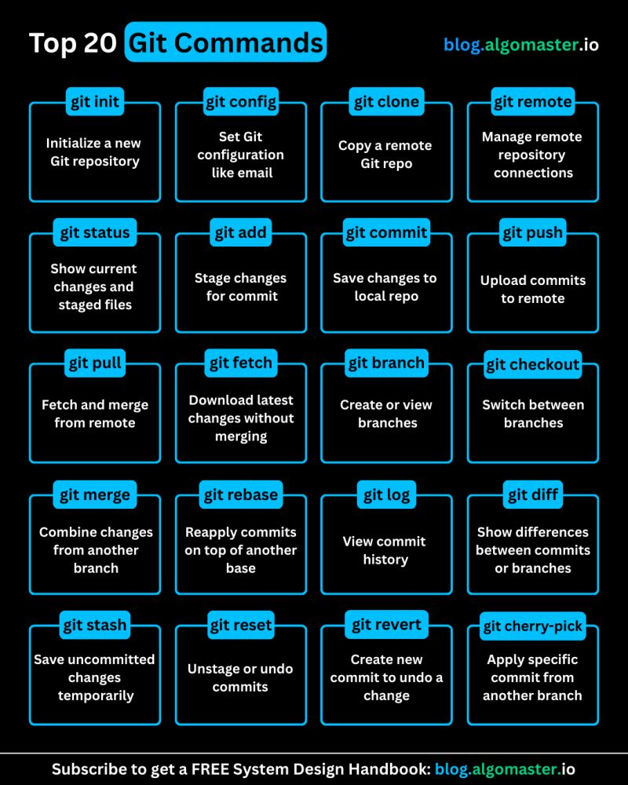
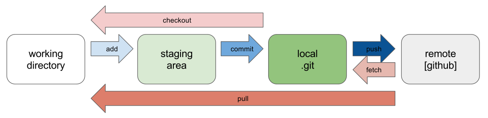

# 📘 Git & GitHub Guide

A beginner-friendly, structured reference for learning Git commands and GitHub workflows — from first commit to open-source contribution.

---

## 📑 Table of Contents

1. [About](#about)
2. [Topics Covered](#topics-covered)
3. [Repository Contents](#repository-contents)
4. [Quick-Start Workflow](#quick-start-workflow)
5. [Core Git Commands](#core-git-commands)
6. [Visual Cheatsheet](#visual-cheatsheet)
7. [Video Resource](#video-resource)
8. [Contributing](#contributing)

---

## About

This repository is a practical guide to using Git and GitHub. It covers everyday commands, branching strategies, team collaboration patterns, and the full open-source contribution workflow (Fork → Clone → Branch → PR).

---

## Topics Covered

| Topic | Description |
|---|---|
| 🚀 Push local project to GitHub | Initialize, commit, and push an existing folder |
| 🍴 Fork vs Clone | When and why to use each |
| 🤝 Team Collaboration | Work with collaborators on a shared repo |
| 🌐 Open-Source Contribution | Fork, upstream sync, PR workflow |
| 📋 Git Cheat Sheet | Most-used commands with explanations |

---

## Repository Contents

```
git-and-github-guide/
├── README.md          ← You are here
├── GUIDE.md           ← Full step-by-step guide (workflows & explanations)
├── COMMANDS.md        ← Reference list of all common Git commands
├── Cheatsheet/        ← Visual cheatsheet images
│   ├── commands&use.jpg
│   ├── commands.png
│   ├── merge&rebase.png
│   └── workflow.png
└── yt_link.txt        ← Linked YouTube tutorial
```

---

## Quick-Start Workflow

### Push an existing project to GitHub

```bash
cd my-project
git init
git add .
git commit -m "Initial commit"
git remote add origin https://github.com/username/my-project.git
git branch -M main
git push -u origin main
```

### Contribute to open source

```bash
# 1. Clone your fork
git clone https://github.com/yourusername/project.git
cd project

# 2. Connect the original repo
git remote add upstream https://github.com/original/project.git

# 3. Create a feature branch
git checkout -b fix-issue-42

# 4. Make changes, then stage and commit
git add .
git commit -m "Fix: describe what you fixed"

# 5. Push your branch and open a Pull Request
git push origin fix-issue-42
```

> 💡 **Daily developer routine:** `git pull` → branch → code → `git add .` → `git commit` → `git push` → Pull Request

---

## Core Git Commands

| Command | Purpose |
|---|---|
| `git init` | Initialize a new local repository |
| `git clone <url>` | Download a repository to your computer |
| `git status` | Show changed / staged files |
| `git add .` | Stage all changes |
| `git commit -m "msg"` | Save a snapshot of staged changes |
| `git push origin <branch>` | Upload commits to GitHub |
| `git pull origin main` | Fetch and merge latest changes |
| `git checkout -b <branch>` | Create and switch to a new branch |
| `git merge <branch>` | Merge a branch into the current one |
| `git log --oneline` | Compact commit history |
| `git remote -v` | List connected remote repositories |
| `git fetch` | Download updates without merging |

See [`COMMANDS.md`](COMMANDS.md) for the full command reference and [`GUIDE.md`](GUIDE.md) for detailed explanations.

---

## Visual Cheatsheet

| Preview | Topic |
|---|---|
|  | Commands & Use |
|  | Commands Overview |
|  | Merge & Rebase |
|  | Git Workflow |

---

## Video Resource

🎥 **YouTube Tutorial:** [Watch here](https://youtu.be/mAFoROnOfHs?si=F5dNMHFa5RiF_v8w)

---

## Contributing

Contributions are welcome!

1. Fork this repository
2. Create a branch: `git checkout -b improve-docs`
3. Commit your changes: `git commit -m "Improve: add missing command examples"`
4. Push the branch: `git push origin improve-docs`
5. Open a Pull Request
